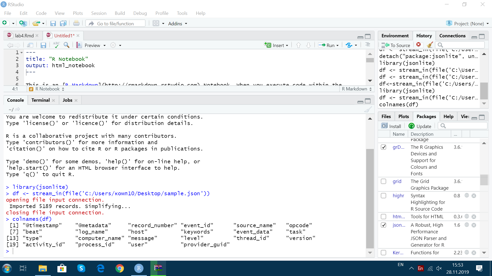
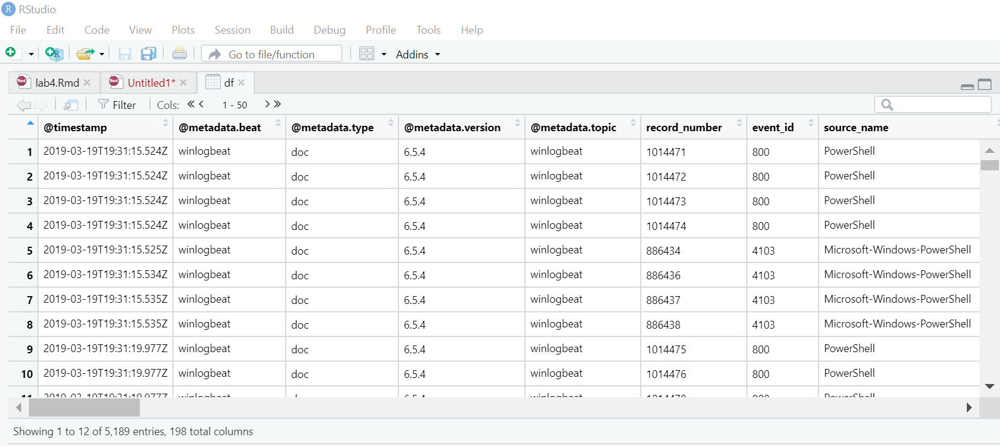
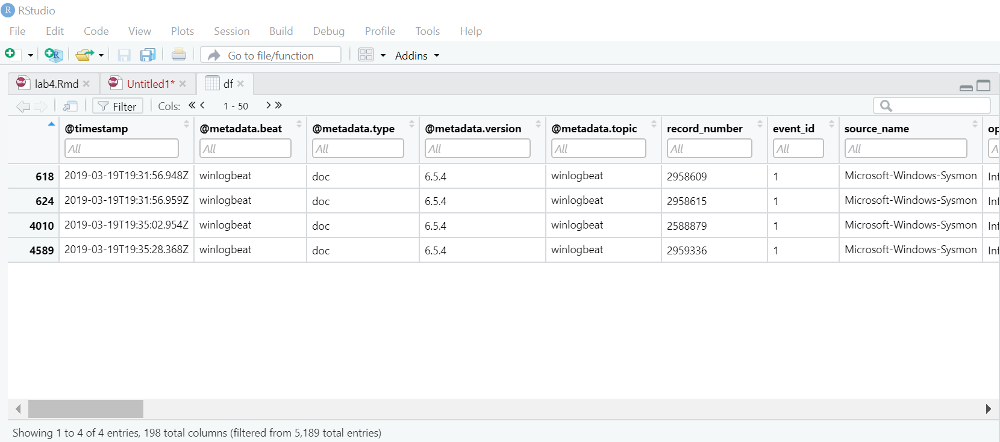
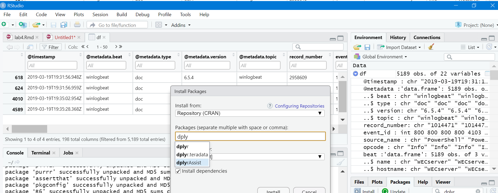
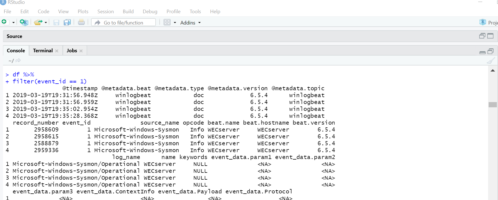
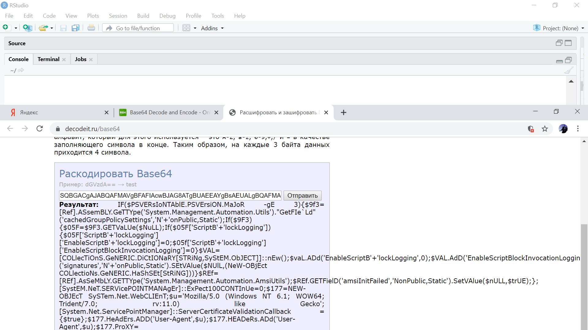
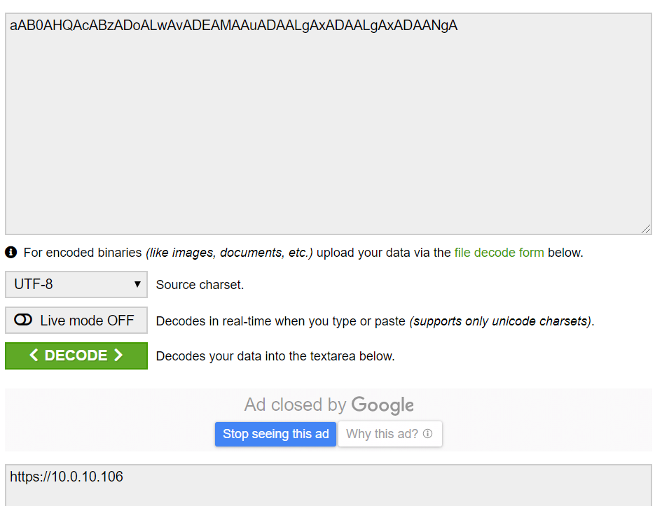

# Поиск IP-адреса злоумышленника


## Цель работы

 Найти IP-адрес злоумышленника.

## Исходные данные

1. Программное обеспечение Windows 10 Pro
2. Rstudio Desktop
3. Интерпретатор языка R 4.1
4. Фрагмент журнала -- файл `sample.json`
     
       
 
## План

1. Перевод файла в формате json в читабельный вид.     
2. Анализ полученных данных.    
3. Поиск IP-адреса злоумышленника.    

## Шаги:   

1. Для начала необходимо перевести файл из формата json. Для этого необходимо установить библиотеку `jsonlite`, позволяющую работать с json в R. 

```
install.packages("jsonlite")
```

2. Далее необходимо импортировать данные в датафрейм df. Теперь можно посмотреть какие столбцы есть в файле.

```
library(jsonlite)    
df <- stream_in(file('sample.json'))
colnames(df)
```



2.Теперь откроем сам файл.




3. Теперь можно ставить различные фильтры на столбцы. Поставим фильтр на столбец event_id = 1  по возрастанию. 1 обозначает событие создания процесса и представляет расширенную информацию о недавно созданном процессе.



4. Далее необходимо установить библиотеку `dplyr`, сфокусированную на инструментах для работы с фреймами данных.



5. Теперь, чтобы отфильтровать нужные данные в файле нужно создать пайп, а далее указать необходимый фильтр.

```
df %>% filter (event_id==1)
```



6. У нас появились данные, закодированные Base64. Необходимо их раскодировать.



7. Важная строчка GETStrinG. Если ее раскодировать, то получаем IP-адрес злоумышленника -- `10.0.10.106`



## Оценка результата

 В результате лабораторной работы мы определили IP-адрес злоумышленика.

## Вывод

Таким образом, мы научились анализировать предоставляемый файл и находить ip-адрес злоумышленника.

