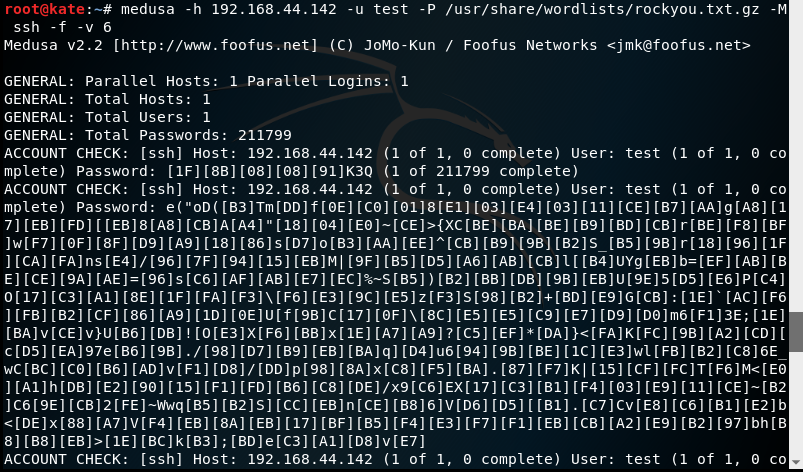
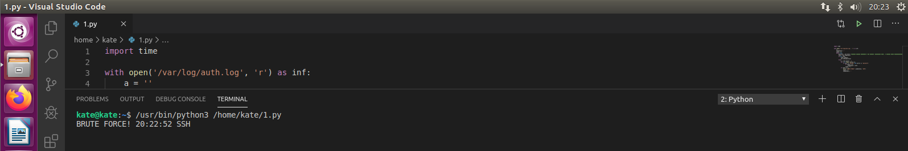
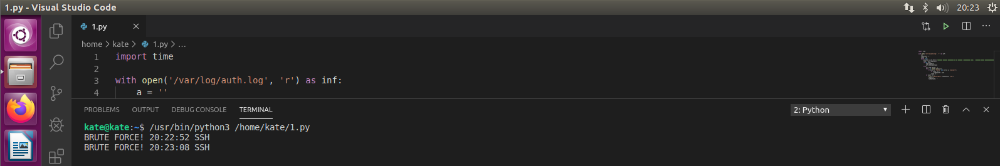

# Разработка программы для обнаружения атаки

## Цель

Написать программу, которая в режиме, близком к реальному, обнаружит атаку brute force.

## Исходные данные

1. Ноутбук с ОС Windows 10
2. Редактор Visual StudioS Code
3. Python 3.7

##Варианты решения задачи

1. Оператор вручную просматривает файлы журналов
1. Написать программу на языке Python.

## План

1. Написать программу
2. Провести атаку brute force
3. Проверить вывод программы

## Описание шагов

1. Код [программы](script.py)

```
import time

with open('/var/log/auth.log', 'r') as inf:
    a = ''
    timeattace = ''
    count = 0
    while True: 
        position = inf.tell() #Текущая позиция указателя — это позиция (количество байт), с которой будет осуществляться следующее чтение/запись.
        line = inf.readline()
        if not line:
            time.sleep(1)
            inf.seek(position)
        else:
            a = line.split(' ')
            for i in range (len(a)-2):
                if a[i] == "Failed" and a[i+1] == "password":
                    if count == 0:
                        timeattace = a[3]
                    count += 1
            if count == 8:
                print ("BRUTE FORCE!",timeattace, "SSH")
                count = 0
                timeattace = ''
```
                
Библиотека time позволяет нам считываеть файл в реальном времени. Я анализирую файл логов `auth.log`.  Мы считываем одну строку из файла (строка 9) и, если она пустая(строка 10), то программа ждет 1 секунду(строка 11). Иначе проводим анализ строки(строка 13). В своей программе я считаю, что атака brute force произошла, когда выражение `"Failed password"` встретилось 8 раз.

2. Проведем атаку brute force с Kali Linux



3. Вывод программы





## Оценка результатов

Задача решена с помощью языка Python. Я научилась считывать файл в реальном времени и анализировать данные.

## Вывод

В данной работе я написала программу, которая предупреждает о наличии brute force - атаки.


