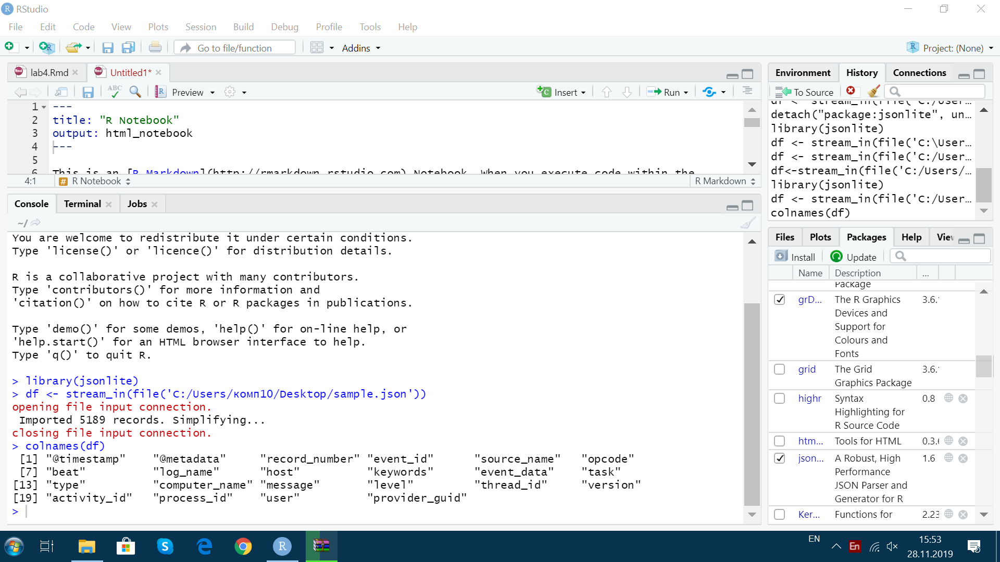
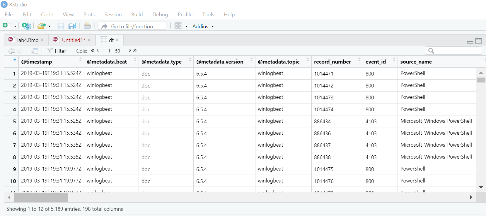
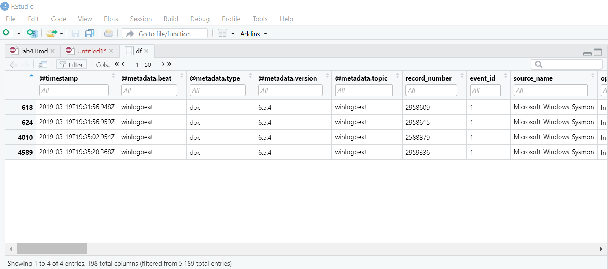
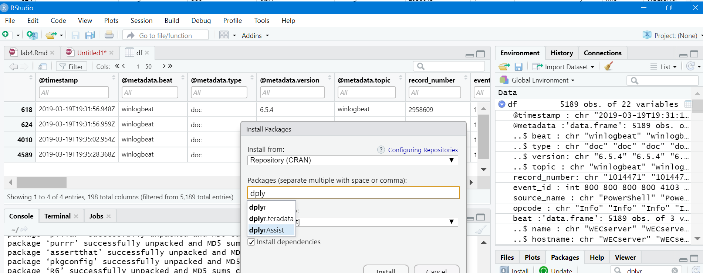
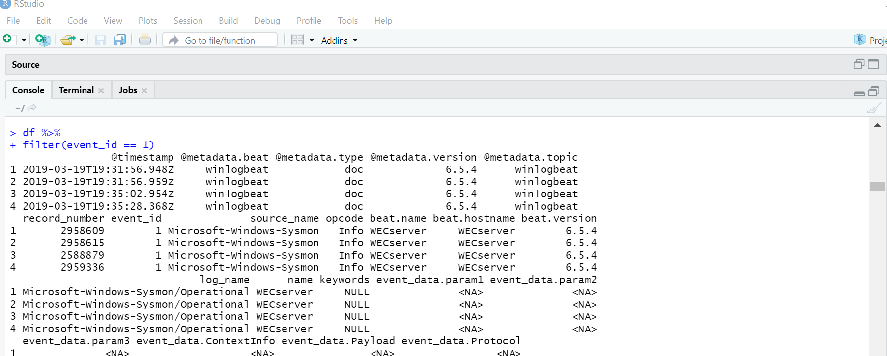
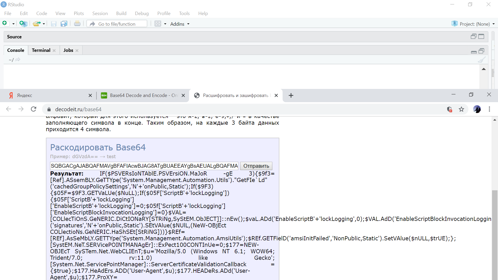
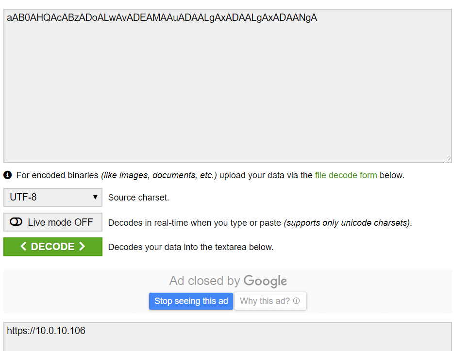

# Поиск IP-адреса злоумышленника
i2z1@yandex.ru

## Цель работы

Найти IP-адрес злоумышленника.

## Исходные данные

1.  Программное обеспечение Windows 10 Pro
2.  Rstudio Desktop
3.  Интерпретатор языка R 4.1
4.  Фрагмент журнала – файл `sample.json`

## План

1.  Перевод файла в формате json в читабельный вид.  
2.  Анализ полученных данных.  
3.  Поиск IP-адреса злоумышленника.

## Шаги:

1.  Для начала необходимо перевести файл из формата json. Для этого
    необходимо установить библиотеку `jsonlite`, позволяющую работать с
    json в R.

<!-- -->

    install.packages("jsonlite")

1.  Далее необходимо импортировать данные в датафрейм df. Теперь можно
    посмотреть какие столбцы есть в файле.

<!-- -->

    library(jsonlite)    
    df <- stream_in(file('sample.json'))
    colnames(df)

2.Теперь откроем сам файл.

1.  Теперь можно ставить различные фильтры на столбцы. Поставим фильтр
    на столбец event_id = 1 по возрастанию. 1 обозначает событие
    создания процесса и представляет расширенную информацию о недавно
    созданном процессе.

1.  Далее необходимо установить библиотеку `dplyr`, сфокусированную на
    инструментах для работы с фреймами данных.

1.  Теперь, чтобы отфильтровать нужные данные в файле нужно создать
    пайп, а далее указать необходимый фильтр.

<!-- -->

    df %>% filter (event_id==1)

1.  У нас появились данные, закодированные Base64. Необходимо их
    раскодировать.

1.  Важная строчка GETStrinG. Если ее раскодировать, то получаем
    IP-адрес злоумышленника – `10.0.10.106`

## Оценка результата

В результате лабораторной работы мы определили IP-адрес злоумышленика.

## Вывод

Таким образом, мы научились анализировать предоставляемый файл и
находить ip-адрес злоумышленника.
